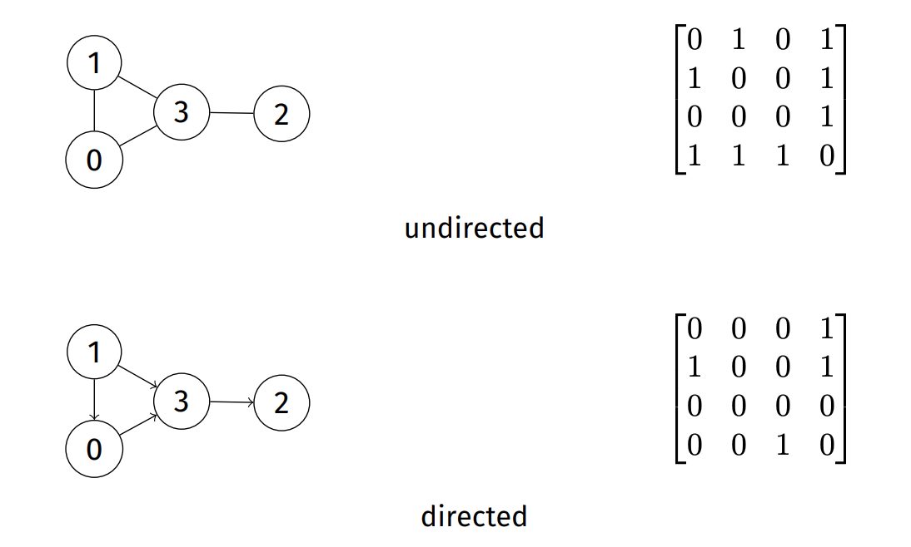
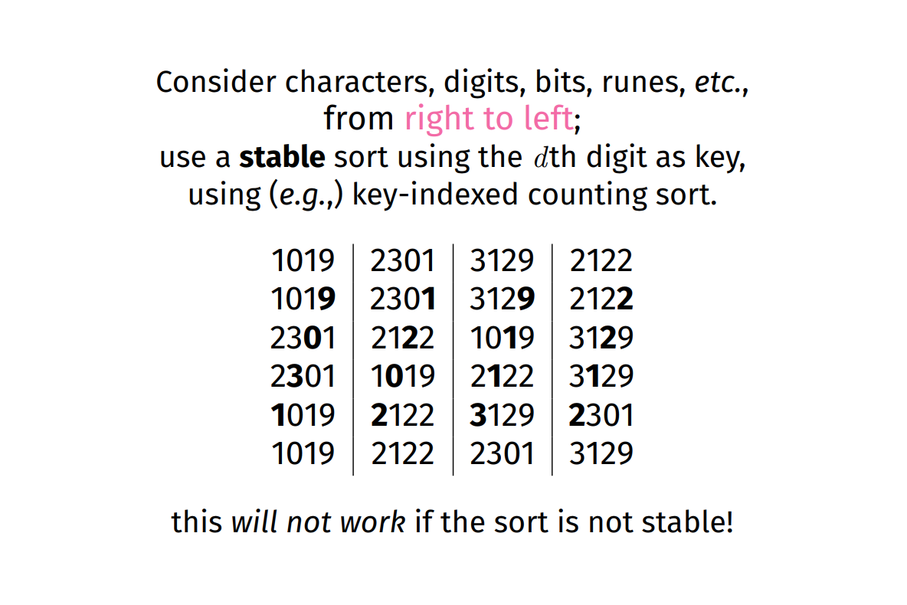

# ADTs
* ADT Interfaces:
  -  Opaque view of a data structure (eg. `typedef struct t *T`, we don't know `struct t`)
  -  Function signatures for all operations
  -  Semantics of operations (via documentation, etc)
  - A contract between ADT and clients
* ADT implementations
  - Concrete defintion of the data structures
  - Function implementations for all operations

# Linked Lists
* A sequence of collection of 'nodes' holding value + pointer(s)
* No random access
* Easy to add, rearrange, remove nodes...
* List nodes references other list nodes:
  * Singly Linked List: `next`
  * Doubly Linked List: `next` `prev`

* Operations
  - Insertion ~ O(N)
  - Deletion ~ O(N)
  - Search ~ O(N)
  - Intersection ~ O(N+M)

# Stacks
* LIFO (Last In First Out) data structure

* List implementation:
  - Push: Append node to head of the list ~ O(1)
  - Pop: Remove and return head ~ O(1)
    ```C
    struct stack {
        struct node *head;
        struct node *tail;
        size_t size;
    };

    struct node {
        Item item;
        struct node *next;
    }
    ```

* Array Implementation
  - Allocate an array with a maximum number of elements
  - Fill items sequentially
  - Maintain a counter of the number of pushed / popped items (ie. the top)
  - Push: Increment top and set new top array index to value ~ O(1)
  - Pop: Decrement top and return the last hightest value
  - Disadvantage: Fixed size stack (Unless it's a dyanamically growing array)
    ```C
    struct stack {
        int top;
        Item *items;
    };
    ```


# Queues
* FIFO (First In First Out) data structure
* List Implementation
```C
struct queue {
    struct node *head;
    struct node *tail;
}

struct node {
    Item item;
    struct node *next;
}
```
- Insert: O(N) - without tail pointer in struct, otherwise O(1)
- Deletion: O(1)

# Analysis 
* Emperical: executing and measuring
* Theoretical: proving and deriving

* Factors:
  - Correctness: returns expected output
  - Robustness: behaves sensibly for non-valid inputs
  - Efficiency: returns results reasonably quickly
  - Clarity: clear code
  - Consistency: interface is clear & consistent

* We will only focus on **correctness** and **efficiency**.

## Testing (Correctness)
* Postel's Robustness Principle: *"Be conservative in what you do; be liberal in what you accept from others"*

* TDD (Test Driven Development): write tests first, then write the function & repeat
* Regression testing: Keep a test suite and always run the tests after each update to the program

* Black-box testing: checks behaviour using only the interface (ie the ADT interface)
* White-box testing: checks internal behaviour (when we can see and test the ADT implementation)

## Complexity (Efficency)
* Alorithm runtime tends to be a function of input size
* Focus on asymptotic worst-case execution time
* Take into account all possible input ranges
* Cases: **Best Case**  **Average Case** **Worst Case**
* Binary search example:
  * start at middle for sorted list
    * is the middle the key? if not continue
  * if item is less, we search in left range (lo, mid)
  * otherwise, we search in right range (mid+1, hi)
* Best case: O(1) ~ middle value
* Worst case:
  * t(N) = 1 + t(N/2) = log(N) + 1
  * ~ O(log n)


* Complexity Classes
  - O(1)          - Constant - Constant time execution, independant of input size.
  - O(log n)      - Logarithmic - Some divide-and-conquer algorithms with trivial split/recombine operations.
  - O(n)          - Linear - Every element of the input has to be processed
  - O(n log n)    - n-log-n - Divide and conquer algorithms, where split / recombine is proportional to input
  - O(n^2)        - Quadratic - Compute every input with every other input
  - O(n^3)        - Cubic - misery
  - O(n!)         - Factorial - what the...
  - O(2^n)        - Exponential - nope
* O(1) < O(log n) < O(n) < O(n log n) < O (n^2) < O(n^3) < O (n!) < O(2^n)
  
* N^2 Algo ie. when N=1000 takes 1.2seconds, how long for
  - N=2000      x2      ->   x4         4.8 seconds
  - N=10,000    x10     ->   x100       120 seconds
  - N=100,000   x100    ->   x10000     12000 seconds
  - N=1000000   x1000   ->   x1000000   1200000 seconds
* Apply ^2 to how much times number of items increases. Multiple that number with base case.

* Tractable: have a polynomial time ('P') algorithm
* Intractable: no tractable algorithm exists (usually 'NP')
* Non-computable: no algorithm exists

# Recursion
* Base case (or stopping case): where no recursive call is needed
* Recursive case: calls the function on a smaller version of the problem.
* Steps:
  1. Solve as if you're not using recursion for basic subset of problem
  2. Use self for solving the rest
* eg. n! = (n-1)! x n
  - f(0)=1 f(1) = 1 else f(n) = n*f(n-1)
* Usually iterative and recusrive has same time complexity (ie. arry_max, binary_search)

# Trees
* Trees are branches data structures of nodes and edges with no cycles.
* Each node contains a value
* Each node has edges <=k other nodes (k = 2 for binary trees)
* Node is parent if it has outgoing edges
* Node is child if it has incoming edges
* Depth (or height) is the number of edges from the root to that node;
* A leaf is a node with no children.
* Trees can be viewed as set of nested structures
* Values in the left subtree has to be less than the node value
* Vice versa for right subtree.
* Degenerate: maximal height 
* Balanced: minimal height
  - Size: |size(L) - size(R)| < 2
  - Height: |height(L) - height(R)| < 2
* Advantages
- Faster search O(log n) - compared with linked lists
- Faster inseartion O(log n) - compared with array O(N)

## Binary trees
* A binary tree with n nodes has a height of at most n-1, if degenerate or least floor(log n) if balanced
* Complete binary tree have hieght ceiling(log n). 
* Insertion: balanced ~ O(log n), degenerate ~ O(n) ie. have to traverse the tree, like a llist
* Search / Deletion: balanced ~ O(log n), degenerate O(n)
* All nodes in left are less than and vice versa
* Structure determined by order of insertion

## Tree Traversals
* Depth First:
  - Pre-order traversal (NLR)
  - In-order traversal (LNR) - visits elements in sorted order - when tree is a BST.
  - Post-order traversal (LRN)
* Breath First:
  - Level-order traversal: visit node and all its children 
    - ie. Like a BFS, where you use a queue
    - basically visits each level from left to right
    - use a queue
    ```C
    void tree_level_order_traversal (Tree t)
    {
        if (!t) return;

        Queue q = newQueue(40);
        QueueJoin(q, t);
        while (!QueueIsEmpty(q)) {
            Item n = QueueLeave(q);
            printf("%d ", n->item);
            if (n->left) QueueJoin(q, n->left);
            if (n->right) QueueJoin(q, n->right);
        }

        dropQueue(q);
    }
    ```
* Tree successors (In order)
    - Case 1: node has right subtree
      -  Find the minimum (left most value) of the right sub tree
    - Case 2: no right subtree
      - TODO!! https://www.youtube.com/watch?v=5cPbNCrdotA&list=PL2_aWCzGMAwI3W_JlcBbtYTwiQSsOTa6P&index=38&t=0s

# Priority Queue (Using Heaps)
* Process in order of key or priority.
* Altered `enqueue` and `dequeue` operations
* `Enqueue`: join item with a priority.
  - FixUp operation has to be done, since we insert node at bottom.
* `Dequeue`: remove item with highest priority Q.
  - FixDown operation has to be done, since we remove top node, by swapping with last item. Last item may not be ideal canditate for top root.
## Heaps
* Commonly viewed as trees, implemented using arrays.
* Two properties to maintain:
  1. heap order property
  2. complete tree property
* Heaps have **top-to-bottom**  ordering (whereas binary trees have left to right ordering)
* Heaps are complete trees!
  - Every level is filled before adding nodes to the next level
  - Nodes in given level are filled left-to-right with ni breaks
* Arrays are good for heaps
  -  parent(i) = i/2
  -  left_child(i) = 2i
  -  right_child(i) = 2i+1
* Inserting:
  1. Add new element at the bottom-most, right-most position (to ensure complete tree property)
  2. Reorganise values along the path to the root (to ensure it maintains heap order)
    - We call this the heap fixup operation
  - O(log n)

* Deleting is a three-step process:
  1. Swap root value with bottom-most, right-most value (ie. last element of array)
  2. Remove that element
  3. Reorganise values along the path from root (to ensure it maintains heap order)
    - We call this the heap fix down operation
  - O(log n)

# Graphs
* Models relationship between items
* A graph G is a set of vertices V and edges E
- E := {(v,w) | v,w is an element of V, (v,w) is an element of V X V}
- Basically a set of edges [(v,w)]


* Simple graphs
- a set of vertices
- a set of undirected edges
- no self loops
- no parallel edges

* Sparcity vs Density
- Sparcity ~ less connections between nodes
  - |E| approach |V|^2
- Density ~ more connections between nodes
  - |V| approach |V|

* Subgraph: subset of vertices and associate edges


* Path: Sequence of connected vertices ie [(v,e) elem 1]
* Simple path: no repeating vertices
* Cycle: path with start and end vertex as the same.


* Connected graph: a path exists from every node to every other node
* Tree: connected graph with no cycles


* Connected components: a graph that's not connected, consisting of a set of connected components.
  - ie. maximally connected subgraphs


* Spanning tree: (of graph) subgraph that connects all its verteces
* Minimum spanning tree: spanning tree that has the least total weight
* Spanning forest: (of graph) subgraph that contains all its vertices and is a set of ›trees


* Clique: complete subgraph


## Graph Representation
* Adjacency Matrix: |V| X |V| matrix; each cell represents an edge


 - Advantages:
   - Easy to implement
   - Words for graph, digraphs, weighted fraphs, multigraphs
   - Time efficient
 - Disadvantage
   - Huge space: V^2
   - Sparce graphs ~> wasted space!
   - undirected graph ~> wasted space!
   - Inefficent initialiseation / vertex- insert/delete

* Adjacency List


Operation | Matrix | List
--- | --- | ---
Space | V^2 | V + E
Initialise | O(V^2) | O(V)
Destroy | O(V) | O(E)
Insert Edge | O(1) | O(V)
Find / Remove Edge | O(1) | O(V)
Is Isolated | O(V) | O(1)
Degree | O(V) | O(E)
Is Adjaceny | O(1) | O(V) 

* Graph ADT
```C
typedef struct graph *Graph;

/** A concrete edge type. */
typedef struct edge { vertex v, w; weight n; } edge;

/** Create a new instance of a Graph. */
Graph graph_new (
    size_t max_edges, /**< maximum value hint */
    size_t max_vertices, /**< maximum value hint */
    bool directed, /**< true if a digraph */
    bool weighted /**< true if edges have weight */
);

/** Deallocate resources used by a Graph. */
void graph_drop (Graph g);
```

## Graph Search (DFS / BFS)
* Problem: Does a path exist between vertex v and w?
* Generic Solution
  - Examine vertices adjacent to `v`;
  - if any of them is `w`, we're done
  - otherwise, check all the adjacent vertices and repeat util we reach `w`

* Simple pattern:
   - Create a structure that will tell us what node to visit next.
   - Add the starting node to that structure
   - While that structure is not empty
     - Get the next vertex from that structure
     - Mark that node as visited (if it isn't visited)
     - Add Neighbours to the structure

* Depth First Search (DFS): Longest paths first ~ uses a `Stack` 
  * Keep track of
    - `count`: number of verticies traversed so far
    - `pre`: order in which vertices were visited
    - `st`: predecessor of each vertex (for spanning tree)
  * Edges traversed in all graph walks form a `spanning tree`, which has
    * edges corresponding to call-tree of recursive function
    * is the original graph sans cycles / alternate graph
    * in general, spanning tree has all vertices and a minimal set of edges to produce a connected graph (ie. no loops, cycles, parallel edges)
  * If a graph is not connected, `DFS` will produce a spanning tree
  * An edge connecting a vertex with an ancestor in the DFS tree that is not its parent is a `back edge` 
* Breath First Search (BFS): Adjacent nodes first ~ uses a `Queue` 
* Dikstra: Lowest-cost paths first

## Directed Graphs
* v -> w 
* eg. follow on twitter / instagram
* In a digraph, edges have direction, self-loops are allowed, parallel edges are allowed
* **in-degree**: number of directed edges leading into a vertex
  * **source**: a vertex with a in-degree 0;
* **out-degree**: number of directed edges leading out of a vertex
  * **sink**: a vertex with out-degree 0;
* **reachability**: indicates existence of directed graph
  * if a direct path `v`,...`w` exists
  * `w` is reachable from `v`.
* **strongly connected**: 
  * if both paths `v`,...,`w` and `w`,...,`v` exist then `v` and `w` are strongly connected
* **strongly connected**: indicates mutual reachability
  - if both paths `v`,...,`w` and `w`,...,`v` exist
  - `v` and `w` are strongly connected
* **strong connectivity**: every vertex reachable from every other vertex
* **strongly-connected component**: maximal strongly-connected subgraph
* Representations
  - Adjacency matrix ... Asymmetrix, sparese, less space efficent
  - Adjaceny List... Fairly common
  - Edge lists... Order of edge components matters
  - Linked data structures.. pointers inherently directional
  * DAGs: Directed Acyclic Graph
    - Tree like where each vertex has children
    - Graph like where child vertex may have multiple parents
    

## Weighted Graphs
* Sometimes we need to assign a cost to a relationship between nodes (ie. distances between two map locations)
* We use geometric interpretation
  - low weight -> short edge
  - high weight -> high edge
* Sometimes weights can be negative
* Representations
  * Adj Matrix: store weight in each cell (not just bool)
    
  * Adj List: Add weight attribute to each list node
  * Edge List: Add weight to each edge
  * Linked data structure: links become link/weight pairs
* Shortest path problem: 
    - Find the minimum cost path between two vertices
    - Edges may be directed or undirected
    - Assuming non-negative weights
* Minimum Spanning Trees
  - Find the weight-minimal set of edges that connects all vertices
  - Multiple solutions may exist
  - Assuming undirected, non-negative weighted graphs
* Shortest Path Search
  - **source-target**: shortest path from `v` to `w`
  - **single-source**: the shortest path from `v` to all other verices
  - **all-pairs**: the shortest paths for all pairs of `v`, `w`
  - Note: If no weights we use least hops
    
    - Edge relaxation along edge `e` from `s` to `t`:
      - `dist[s]` is length of some path from `v` to `s`
      - `dist[t]` is length of some path from `v` to `t`
      - if `e` gives shorter path `v` to `t` via `s`, update `dist[t]` and `st[t]`.
      - basically update the distance and spanning tree if a shorter path has been found.
  - **Complexity**:
    - Using Adj List: O(E log V)
    - Using Adj Matrix: O(V^2)
    - Same as BFS/DFS but using a PQueue

## MSTs
* Applications:
  - Routing and network layout
  - Economical construction of electric power network
* Kruskal: grow many forests
  * Algo
    1. Take all edges and sort according to weight
    2. For each edge add to new graph, unless it introduces a cycle
 * Cycle checking is really expensive
 * Sorting: O(E log E)
* Prim: Maintain a connectivity frontier
  * Algo
    1. Start from any vertex s with an empty MST
    2. Choose edge not already in MST to add
        - Must not contain a self-loop
        - Must connect to a vertex already on MST
        - Must have minimal weight of all such edges
    3. Check to see whether adding the new edge brought any of the non-tree vertices closer to the MST
    4. Repeat until MST has all vertices
  * Basically dijkstra's SSSP algorithm

## Computability
* Hamilton Paths and Tours
  - **Hamilton path**: path in graph that visits each vertex exactly once.
  - **Hamilton tour**: hamiltonian path that's a cycle.
  - BRUTE FORCE! enumerate every possible path, and check each one
    - Hack a BFS or DFS to do it
    - Keep a counter of vertices visited in current path
    - Only accept a path if count is equal to the number of verticies
    - Must inspect every possible path in graph = (V/e)^V
    - NP problem (non-deterministic polynomial)

* Euler Paths and Tours
  - **Euler path**: path in graph that visits every edge exactly once. Starts and ends with different vertices.
  - **Euler tour**: path in graph that uses every edge of a exactly once. Starts and ends on same vertex.
  - Can be found in linear time

* Tractable Problems
  - can we find a simple path connecting two vertices in a graph?
  - What's the shortest path?
  - Given two colors, can we colour every vertex in a graph such that no two adjacent vertices are the same colour?
  - Is there a clique in a given graph?

* Intractable Problems
  - What's the longest path
  - Given three colors, can we colour every vertex in a graph such that no two adjacent vertices are the same colour?
  - What's the largest clique

* Graph Isomorphism: Can we make two given graphs identical by renaming verticies?
  * No general solution exists...

# Sorting
* Analysing sorting algorithms:
    - N: number of items (hi + lo + 1)
    - C: number of comparisons between items
    - S: the number of times items are swappped
* Aim to minimise C and S

## Bubble Sort
* Steps:
  1. Swap adjacent nodes if left > right
  2. Repeat the above
* best: O(n^2)
* worst: O(n^2)
* stable / in place
* Adaptive (Optional - early exit if sorted) ~ best: O(n)

## Selection Sort`
* Steps:
  1. Select the smallest element.
  2. Swap it with first position.
  3. Repeat above with first position increased and search boundry decreased.
* best: O(n^2)
* worst: O(n^2)


## Insertion Sort
* Steps:
  1. Take the first element, insert into the first position.
  2. This is the start of our sorted sublist
  3. Take the next element, insert into the sorted sublist, in the right spot!
  4. Repeat until sorted!


## Shell Sort
* Steps:
  1. Initialize the value of h
  2. Divide the list into smaller sub-list of equal interval h
  3. Sort these sub-lists using insertion sort
  4. Repeat until complete list is sorted


## Merge Sort
* Divide and conquer
* Steps:
  1. Partion the input into two equal size parts.
  2. Recursively sort each of the partitions.
  3. Merge the two sorted partitons back together.


* Worst: O(n log n)
* Merge sort uses a trivial split operation
* Most of the work is done in the merge operation
  * ie. end = MIN(i + 2*m - 1, hi)

## Quick Sort
* Divide and conquer
* Partition / Pivot Steps
  1. Choose the highest index value has pivot
  2. Take two variables to point left and right of the list excluding pivot
  3. left points to the low index
  4. right points to the high
  5. while value at left is less than pivot move right
  6. while value at right is greater than pivot move left
  7. if both step 5 and step 6 does not match swap left and right
  8. if left ≥ right, the point where they met is new pivot
* Quick sort steps
  1. Make the right-most index value pivot
  2. partition the array using pivot value
  3. quicksort left partition recursively
  4. quicksort right partition recursively


* Unstable
* M-O-3: use the middle value of array a[lo, mid, hi] as the pivot, where a[lo] <= a[mid] <= a[hi]
* O(log n) best case
* M-O-3 / random: O(n log n) worst & avg case

## Key-Indexed (Counting sort)
* Non-comparison
* Just access keys based on ordered values
* O(n) worst case

## Heap
* Non-comparison
* Steps:
  1. Add all items to pqueue.
  2. Remove items from pqueue into original array.
* best: Ω(n log(n))
* worst: O(n log(n))
* not stable

## Radix Sort
* Non-comparison
* Only if we can decompose keys
* Sorting individually on each part of the key at a time:
  * digit by digit



# Balanced Trees
* Size balanced: |size(t.L) - size(t.R)| < 2
* height balanced: |height(t.L) - height(t.R)| < 2

* Amortisation: reducing average work over time 


# Hash Tables
* Linked list, Tree, etc... have pretty slow insert and search operations
* They don't take advantage of cache locality
* Hashing lets us approximate
    - Arbitrary keys (ie. strings etc)
    - Map key tointo a compact range of index values
    - Store items in array, accessed by index value
    - O(1)
* What we need
  - Array of items
  - Hash function: hash(key) -> index
  - Collision resolution method (ie. when value already exists for given key)
* Properties we want for the hasing function, `h`:
  - For a table size `N`, output range is `0` to `N-1`
  - pure, deterministic `h(k,N)` ~ ie. gives same result
  - spreads key values uniformly over index range
  - cheap (enough) to compute
* Other properties we need for `h`:
  - Pre-image resistant: `h=HASH(M)`, given h, hard to pick `m`
  - Second pre-image resistant: for `HASH(m1) = HASH(m2)`, given `m1`, it's hard to find `m2`
  - Collision resistant: hard to find `m1` and `m2`
* What if two keys hash to the same index?
  - Allow for multiple items in a single location?
  - Systematically compute new indices by various probing strategies
  - Resize the array by adjusting hashing function, and rehash all values into new array
* Given `N` slots and `M` items:
  * best case: all lists have length `M/N`
  * worst case:  one list with length `M`, all other 0
* With good hash and `M <= N`, cost `O(1)`
* With good hash and `M > N`, cost `O(M/N)`
* `M/N` ratio is called **load**

* Collision Resolution
  - Chaining
    - Using a linked list
    - Using a tree (a bit more efficent O(log n) search)
  - Linear Probing
    - If table is not close to being full, there are still many empty slots, we could just use the next available slot along
      - to reach first item: O(1)
      - to reach subsequent items, depends on `load`
      - worst case: O(N)
  - Double Hash Probing
    - If key already exists, hash again and add the new value to the incremented index (ie. index = hash1(key) + hash2(key))
    - Hash1 to Hash2 should be relatively prime to each other, and to N
    - Faster than linear probing
  - Resize table
    - You'll need to rehash and insert into table again.
* Performance:
  - Good HASH function is critical
  - Choosing a good N for M is critical (ie. managing the load)
  - Choosing a good resolution approach is critical
    - Linear probing is fastest, given big N!
    - Double hasing: faster for higher load, more efficient
    - Chaining: pssible for loads that are greater than 1, but degenerates