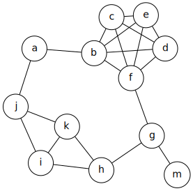
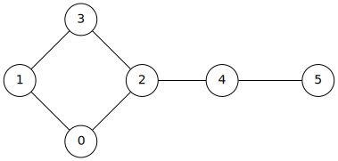
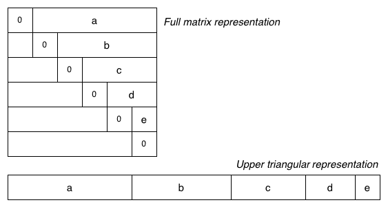

# In A Fix(-Up)
Consider a Heap ADT:
```C
typedef struct heap *Heap;
typedef enum heap_ordering {
	HEAP_ORD_MINIMUM,	/**< The minimum value at the root. */
	HEAP_ORD_MAXIMUM,	/**< The maximum value at the root. */
} heap_ordering;
Heap heap_new (heap_ordering);
void heap_drop (Heap);
void heap_insert (Heap, Item);
Item heap_remove (Heap);
size_t heap_size (Heap);
```
And given an implementation using an array:
```C
struct heap {
   size_t n_items;
   size_t capacity;
   Item *items;
};
```
If a heap is created to hold up to 10 integer-type Items, and higher values have higher priority, show the state of the heap after each of the following operations:
```C
Item it;
Heap h = heap_new (HEAP_ORD_MAXIMUM);
heap_insert (h, 10);
heap_insert (h, 5);
heap_insert (h, 15);
heap_insert (h, 3);
heap_insert (h, 16);
heap_insert (h, 13);
heap_insert (h, 6);
it = heap_delete (h);
heap_insert (h, 2);
it = heap_delete (h);
it = heap_delete (h);
it = heap_delete (h);
it = heap_delete (h);
it = heap_delete (h);
```
Repeat the above sequence of insertions and deletions, but this time draw the heap as a binary tree, with the highest value at the root, and the values decreasing as you move down any branch.

# Graphic Fundamentals
For the following graph:


Give examples of the smallest and largest of each of the following:
* path
* cycle
* spanning tree
* clique

## Answer


# Represent!
Consider our Graph ADT, a portion of which has been reproduced here.
```C
typedef struct graph *Graph;
typedef int vertex;
typedef struct edge { vertex v, w; } edge;
```
In lectures, we looked briefly at several different implementations of graphs, including adjacency matrices and adjacency lists.
```C
// An unweighted graph stored as an adjacency matrix
// (a V×V matrix where each edge is represented twice)
struct graph {
	size_t n_vertices, n_edges;
	bool **adj_matrix;
};
// A graph stored as an adjacency list
// (where each edge appears in two lists --
// one for `v' and one for `w')
struct graph {
	size_t n_vertices, n_edges;
	struct adjnode {
		vertex v;
		struct adjnode *next;
	} *adj_list;
};
typedef struct adjnode adjnode;
```
Consider the types from this ADT, and these representations (unless told otherwise) when answering these questions.

# Disconnect
How could this graph be stored using an adjacency matrix? How about an adjacency list?

## Answer

# Edgy Matters
Implement a function
```C
bool graph_has_edge_p (Graph g, edge e);
```
that tests whether a given edge is present in the graph. The function should return true if the edge exists in the graph, and false otherwise.

Implement this function for both the adjacency-matrix and the adjacency-list representations.
## Solution
```C
// Adj Matrix
bool graph_has_edge_p (Graph g, edge e)
{
  return g->adj_matrix[e.v][e.w];
}

// Adj list
bool graph_has_edge_p (Graph g, edge e)
{
  adj_node *pivot = g->adj_list[e.v];
  for ( ; pivot; pivot = pivot->next)
    if (pivot->v == e->w) return true;
  return false;
}
```

# One edge, ah, ah, ah…
Consider a variation on the adjacency matrix above, where we don’t store the number of edges, n_edges –
```C
struct graph {
	size_t n_vertices;
	bool **adj_matrix;
};
```
Write a C function to count the number of distinct edges in the graph.
```C
size_t graph_num_edges (Graph g);
```
## Solution
```C
size_t graph_num_edges (Graph g)
{
  
}
```

# Two edge, ah ah ah…
There’s other representations of graphs, of course: we briefly mentioned the edge list, popular in database systems. Here’s a function that takes a Graph and produces an edge list and the number of edges:
```C
edge *graph_to_edges (Graph g, size_t *n_edges);

// ... which we might use as:
size_t n;  edge *es = graph_to_edges (g, &n);
```
However, we’re currently storing an adjacency matrix and an adjacency list – so implement this graph_to_edges function for each of those representations. It should return the edges in a “normalised” or “canonical” form, where for all edges e, e.v < e.w, so each edge appears exactly once in the edge list.
## Answer

# Costly Matters
Given our adjacency matrix and adjacency list representations, how much memory do we need? Analyse the storage costs for the two representations, in terms of the number of vertices V, and the number of edges E, and determine roughly the point at which it is more storage efficient to use an adjacency matrix or an adjacency list representation.

For the purposes of the analysis, ignore the cost of storing the graph structure. Assume that each pointer is 4 bytes long, a vertex value is 4 bytes, a linked list adjnode is 8 bytes long, that the adjacency matrix is a complete V×V matrix, and each adjacency matrix element is 1 byte long.
## Answer


# Thinned Out
The standard adjacency matrix representation for a graph uses a full V×V matrix, and stores each edge twice (as (v,w) and (w,v)). This consumes a lot of space, and if the graph is sparse, wastes a lot of space. One simple way to improve the space usage is to choose an appropriate storage type: some implementations use int, which would use 4 bytes over a bool which would use only one byte. (Some compilers may magically compress arrays of bool into sequences of bits, but we won’t rely on this.)

We could use even less space by storing just the upper (or lower) triangular part of the matrix, as shown in the diagram below:



The V×V matrix has been replaced by a single array containing just the “useful” parts of the matrix. This gives a new Graph representation:
```C
// Upper-triangular adjacency matrix graph representation
struct graph {
	size_t n_vertices, n_edges;
	bool *edges;
};
```

Unfortunately, accessing the elements is no longer as simple as edges[v][w].

Write a function that takes two vertices from an edge and determines the corresponding index in the edges array, which holds the Boolean value for this edge. Start with the function template
```C
size_t graph_utm_index_of (size_t nV, vertex v, vertex w)
{
	assert (v != w);    // no self-edges
	if (v > w) { vertex tmp = v; v = w; w = tmp; }
	...
}
```
## Solution
```C

```

Through The Flensing-Glass
The standard implementation of the adjacency list representation for graphs stores each edge twice. The edge (v,w) appears as a w stored in the adjacency list for v, and as a v stored in the adjacency list for w. A more storage efficient representation, analogous to storing just the top-right half of the adjacency matrix, would be to store information for each edge just once.

Implement these functions on adjacency lists, but use this each-edge-stored-once variation:
```C
void graph_insert_edge (Graph g, edge e);
void graph_remove_edge (Graph g, edge e);
size_t graph_vertex_degree (Graph g, vertex v);
```
You should not assume that supplied edge values will necessarily satisfy e.v < e.w.

## Solution
