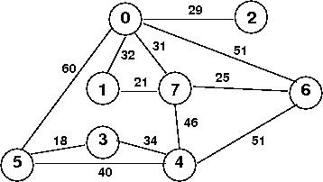
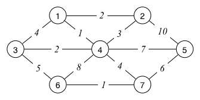

# Depth-First and Breadth-First
Consider the following code and the following graph:
```C
void graph_dfs (Graph g, vertex v,
	size_t *count, vertex pre[], vertex st[])
{
	Stack s = stack_new ();
	stack_push (s, (edge){ v, v });
	while (stack_size (s) > 0) {
		edge e = stack_pop (s);
		if (pre[e.w] != -1) continue;
		pre[e.w] = (*count)++; st[e.w] = e.v;
		printf ("%d\n", e.w);
		for (int i = 0; i < g->nV; i++) {
			if (has_edge (g, e.w, i) && pre[i] == -1)
				stack_push (s, (edge){ e.w, i });
		}
	}
}
```


Show what would be printed by these iterative DFS and BFS traversals for the following function calls:

```C
graph_dfs (g, 0, &count, pre, st);
graph_dfs (g, 3, &count, pre, st);

graph_bfs (g, 0, &count, pre, st);
graph_bfs (g, 3, &count, pre, st);
```

You should also show the state of the stack or queue, and the pre and st arrays explicitly in each step. You should assume the pre and st arrays have already been initialised to -1 for all values.
## Answer
```C
graph_dfs (g, 0, &count, pre, st);
```
stack |
--- | ---| ---| ---| ---| --- | --- | ---| ---| ---| ---| ---

pre |  0  |  1  |  2  |  3  |  4  |  5  |  6  |  7  |
--- | --- | --- | --- | --- | --- | --- | --- | --- | 
----| -1  | -1  | -1  | -1  | -1  | -1  | -1  | -1  |

st  |  0  |  1  |  2  |  3  |  4  |  5  |  6  |  7  |
--- | --- | --- | --- | --- | --- | --- | --- | --- | 
----| -1  | -1  | -1  | -1  | -1  | -1  | -1  | -1  |

---

stack | (0,1) | (0,2) | (0,5)| (0,6) | (0,7)   
--- | ---| ---| ---| ---| --- | --- | ---| ---| ---| ---| ---

pre |  0  |  1  |  2  |  3  |  4  |  5  |  6  |  7  |
--- | --- | --- | --- | --- | --- | --- | --- | --- | 
----|  0  | -1  | -1  | -1  | -1  | -1  | -1  | -1  |

st  |  0  |  1  |  2  |  3  |  4  |  5  |  6  |  7  |
--- | --- | --- | --- | --- | --- | --- | --- | --- | 
----|  0 | -1  | -1  | -1  | -1  | -1  | -1  | -1  |

**Output**
```
0
```
---

stack | (0,1) | (0,2) | (0,5) | (0,6) | (7, 1) | (7, 4) | (7, 6)
--- | ---| ---| ---| ---| --- | --- | ---| ---| ---| ---| ---


pre |  0  |  1  |  2  |  3  |  4  |  5  |  6  |  7  |
--- | --- | --- | --- | --- | --- | --- | --- | --- | 
----|  0  | -1  | -1  | -1  | -1  | -1  | -1  |  1  |

st  |  0  |  1  |  2  |  3  |  4  |  5  |  6  |  7  |
--- | --- | --- | --- | --- | --- | --- | --- | --- | 
----|  0  | -1  | -1  | -1  | -1  | -1  | -1  |  0  |

**Output**
```
7
```
---

stack | (0,1) | (0,2) | (0,5) | (0,6) | (7, 1) | (7, 4) | (6, 4)
--- | ---| ---| ---| ---| --- | --- | ---| ---| ---| ---| ---


pre |  0  |  1  |  2  |  3  |  4  |  5  |  6  |  7  |
--- | --- | --- | --- | --- | --- | --- | --- | --- | 
----|  0  | -1  | -1  | -1  | -1  | -1  |  2  |  1  |

st  |  0  |  1  |  2  |  3  |  4  |  5  |  6  |  7  |
--- | --- | --- | --- | --- | --- | --- | --- | --- | 
----|  0  | -1  | -1  | -1  | -1  | -1  |  7  |  0  |

**Output**
```
6
```
---

stack | (0,1) | (0,2) | (0,5) | (0,6) | (7, 1) | (7, 4) | (4, 3) | (4, 5)
--- | ---| ---| ---| ---| --- | --- | ---| ---| ---| ---| ---


pre |  0  |  1  |  2  |  3  |  4  |  5  |  6  |  7  |
--- | --- | --- | --- | --- | --- | --- | --- | --- | 
----|  0  | -1  | -1  | -1  |  3  | -1  |  2  |  1  |

st  |  0  |  1  |  2  |  3  |  4  |  5  |  6  |  7  |
--- | --- | --- | --- | --- | --- | --- | --- | --- | 
----|  0  | -1  | -1  | -1  |  6  | -1  |  7  |  0  |

**Output**
```
4
```

---

stack | (0,1) | (0,2) | (0,5) | (0,6) | (7, 1) | (7, 4) | (4, 3) | (5, 3)
--- | ---| ---| ---| ---| --- | --- | ---| ---| ---| ---| ---


pre |  0  |  1  |  2  |  3  |  4  |  5  |  6  |  7  |
--- | --- | --- | --- | --- | --- | --- | --- | --- | 
----|  0  | -1  | -1  | -1  |  3  |  4  |  2  |  1  |

st  |  0  |  1  |  2  |  3  |  4  |  5  |  6  |  7  |
--- | --- | --- | --- | --- | --- | --- | --- | --- | 
----|  0  | -1  | -1  | -1  |  6  |  4  |  7  |  0  |

**Output**
```
5
```

---

stack | (0,1) | (0,2) | (0,5) | (0,6) | (7, 1) | (7, 4) | (4, 3)
--- | ---| ---| ---| ---| --- | --- | ---| ---| ---| ---| ---


pre |  0  |  1  |  2  |  3  |  4  |  5  |  6  |  7  |
--- | --- | --- | --- | --- | --- | --- | --- | --- | 
----|  0  | -1  | -1  |  5  |  3  |  4  |  2  |  1  |

st  |  0  |  1  |  2  |  3  |  4  |  5  |  6  |  7  |
--- | --- | --- | --- | --- | --- | --- | --- | --- | 
----|  0  | -1  | -1  |  5  |  6  |  4  |  7  |  0  |

**Output**
```
3
```

---
stack | (0,1) | (0,2) | (0,5) | (0,6) | 
--- | ---| ---| ---| ---| --- | --- | ---| ---| ---| ---| ---


pre |  0  |  1  |  2  |  3  |  4  |  5  |  6  |  7  |
--- | --- | --- | --- | --- | --- | --- | --- | --- | 
----|  0  |  6  | -1  |  5  |  3  |  4  |  2  |  1  |

st  |  0  |  1  |  2  |  3  |  4  |  5  |  6  |  7  |
--- | --- | --- | --- | --- | --- | --- | --- | --- | 
----|  0  |  7  | -1  |  5  |  6  |  4  |  7  |  0  |

**Output**
```
1
```

---
stack | (0,1) | 
--- | ---| ---| ---| ---| --- | --- | ---| ---| ---| ---| ---


pre |  0  |  1  |  2  |  3  |  4  |  5  |  6  |  7  |
--- | --- | --- | --- | --- | --- | --- | --- | --- | 
----|  0  |  6  | 7  |  5  |  3  |  4  |  2  |  1  |

st  |  0  |  1  |  2  |  3  |  4  |  5  |  6  |  7  |
--- | --- | --- | --- | --- | --- | --- | --- | --- | 
----|  0  |  7  |  0  |  5  |  6  |  4  |  7  |  0  |

**Output**
```
2
```

---
stack |
--- | ---| ---| ---| ---| --- | --- | ---| ---| ---| ---| ---


pre |  0  |  1  |  2  |  3  |  4  |  5  |  6  |  7  |
--- | --- | --- | --- | --- | --- | --- | --- | --- | 
----|  0  |  6  | 7  |  5  |  3  |  4  |  2  |  1  |

st  |  0  |  1  |  2  |  3  |  4  |  5  |  6  |  7  |
--- | --- | --- | --- | --- | --- | --- | --- | --- | 
----|  0  |  7  |  0  |  5  |  6  |  4  |  7  |  0  |

---

```C
graph_dfs (g, 3, &count, pre, st);
```
stack |
--- | ---| ---| ---| ---| --- | --- | ---| ---| ---| ---| ---

pre |  0  |  1  |  2  |  3  |  4  |  5  |  6  |  7  |
--- | --- | --- | --- | --- | --- | --- | --- | --- | 
----| -1  | -1  | -1  | -1  | -1  | -1  | -1  | -1  |

st  |  0  |  1  |  2  |  3  |  4  |  5  |  6  |  7  |
--- | --- | --- | --- | --- | --- | --- | --- | --- | 
----| -1  | -1  | -1  | -1  | -1  | -1  | -1  | -1  |

---
stack | (3,4) | (3, 5)
--- | ---| ---| ---| ---| --- | --- | ---| ---| ---| ---| ---

pre |  0  |  1  |  2  |  3  |  4  |  5  |  6  |  7  |
--- | --- | --- | --- | --- | --- | --- | --- | --- | 
----| -1  | -1  | -1  |  0  | -1  | -1  | -1  | -1  |

st  |  0  |  1  |  2  |  3  |  4  |  5  |  6  |  7  |
--- | --- | --- | --- | --- | --- | --- | --- | --- | 
----| -1  | -1  | -1  |  3  | -1  | -1  | -1  | -1  |

**Output**
```
3
```

---
stack | (3,4) | (5,4) | (5,0)
--- | ---| ---| ---| ---| --- | --- | ---| ---| ---| ---| ---

pre |  0  |  1  |  2  |  3  |  4  |  5  |  6  |  7  |
--- | --- | --- | --- | --- | --- | --- | --- | --- | 
----| -1  | -1  | -1  |  0  | -1  |  1  | -1  | -1  |

st  |  0  |  1  |  2  |  3  |  4  |  5  |  6  |  7  |
--- | --- | --- | --- | --- | --- | --- | --- | --- | 
----| -1  | -1  | -1  |  3  | -1  |  3  | -1  | -1  |

**Output**
```
5
```
---
stack | (3,4) | (5,4) | (0, 1) | (0,2) | (0,6) | (0,7) 
--- | ---| ---| ---| ---| --- | --- | ---| ---| ---| ---| ---

pre |  0  |  1  |  2  |  3  |  4  |  5  |  6  |  7  |
--- | --- | --- | --- | --- | --- | --- | --- | --- | 
----|  2  | -1  | -1  |  0  | -1  |  1  | -1  | -1  |

st  |  0  |  1  |  2  |  3  |  4  |  5  |  6  |  7  |
--- | --- | --- | --- | --- | --- | --- | --- | --- | 
----|  5  | -1  | -1  |  3  | -1  |  3  | -1  | -1  |

**Output**
```
0
```
---
stack | (3,4) | (5,4) | (0, 1) | (0,2) | (0,6) | (7, 1) | (7, 4) | (7,6) 
--- | ---| ---| ---| ---| --- | --- | ---| ---| ---| ---| ---

pre |  0  |  1  |  2  |  3  |  4  |  5  |  6  |  7  |
--- | --- | --- | --- | --- | --- | --- | --- | --- | 
----|  2  | -1  | -1  |  0  | -1  |  1  | -1  |  3  |

st  |  0  |  1  |  2  |  3  |  4  |  5  |  6  |  7  |
--- | --- | --- | --- | --- | --- | --- | --- | --- | 
----|  5  | -1  | -1  |  3  | -1  |  3  | -1  |  0  |

**Output**
```
7
```
---
stack | (3,4) | (5,4) | (0, 1) | (0,2) | (0,6) | (7, 1) | (7, 4) | (6, 4)
--- | ---| ---| ---| ---| --- | --- | ---| ---| ---| ---| ---

pre |  0  |  1  |  2  |  3  |  4  |  5  |  6  |  7  |
--- | --- | --- | --- | --- | --- | --- | --- | --- | 
----|  2  | -1  | -1  |  0  | -1  |  1  |  4  |  3  |

st  |  0  |  1  |  2  |  3  |  4  |  5  |  6  |  7  |
--- | --- | --- | --- | --- | --- | --- | --- | --- | 
----|  5  | -1  | -1  |  3  | -1  |  3  |  7  |  0  |

**Output**
```
6
```
---
stack | (3,4) | (5,4) | (0, 1) | (0,2) | (0,6) | (7, 1) | (7, 4) | 
--- | ---| ---| ---| ---| --- | --- | ---| ---| ---| ---| ---

pre |  0  |  1  |  2  |  3  |  4  |  5  |  6  |  7  |
--- | --- | --- | --- | --- | --- | --- | --- | --- | 
----|  2  | -1  | -1  |  0  |  5  |  1  |  4  |  3  |

st  |  0  |  1  |  2  |  3  |  4  |  5  |  6  |  7  |
--- | --- | --- | --- | --- | --- | --- | --- | --- | 
----|  5  | -1  | -1  |  3  |  6  |  3  |  7  |  0  |

**Output**
```
4
```
---
stack | (3,4) | (5,4) | (0, 1) | (0,2) | (0,6) 
--- | ---| ---| ---| ---| --- | --- | ---| ---| ---| ---| ---

pre |  0  |  1  |  2  |  3  |  4  |  5  |  6  |  7  |
--- | --- | --- | --- | --- | --- | --- | --- | --- | 
----|  2  |  6  | -1  |  0  |  5  |  1  |  4  |  3  |

st  |  0  |  1  |  2  |  3  |  4  |  5  |  6  |  7  |
--- | --- | --- | --- | --- | --- | --- | --- | --- | 
----|  5  |  7  | -1  |  3  |  6  |  3  |  7  |  0  |

**Output**
```
1
```
---
stack | (3,4) | (5,4) | (0, 1)
--- | ---| ---| ---| ---| --- | --- | ---| ---| ---| ---| ---

pre |  0  |  1  |  2  |  3  |  4  |  5  |  6  |  7  |
--- | --- | --- | --- | --- | --- | --- | --- | --- | 
----|  2  |  6  |  7  |  0  |  5  |  1  |  4  |  3  |

st  |  0  |  1  |  2  |  3  |  4  |  5  |  6  |  7  |
--- | --- | --- | --- | --- | --- | --- | --- | --- | 
----|  5  |  7  |  0  |  3  |  6  |  3  |  7  |  0  |

**Output**
```
2
```

---
stack |
--- | ---| ---| ---| ---| --- | --- | ---| ---| ---| ---| ---

pre |  0  |  1  |  2  |  3  |  4  |  5  |  6  |  7  |
--- | --- | --- | --- | --- | --- | --- | --- | --- | 
----|  2  |  6  |  7  |  0  |  5  |  1  |  4  |  3  |

st  |  0  |  1  |  2  |  3  |  4  |  5  |  6  |  7  |
--- | --- | --- | --- | --- | --- | --- | --- | --- | 
----|  5  |  7  |  0  |  3  |  6  |  3  |  7  |  0  |
---

```C
graph_bfs (g, 0, &count, pre, st);
```
// Do exact same thing, but with a queue
---
Using the relevant information from your DFS and/or BFS search, what is the shortest unweighted (least hops) path from 3 to 2?
## Answer
3 -> 5 -> 0 -> 2

# A Relaxing Time
Consider the following code for Dijkstra’s algorithm:
```C
void dijkstra(Graph g,Vertex s)
{
	int v,t;
	PriQ pq = initPriQ(g->nV);
	//insert each vertex into the pq
	for(v=0;v< g->nV;v++){
		insert(pq,newItem(dist[v],v));
	}
	dist[s] = 0.0; //set start vertex dist to 0
	increasePriority(pq,s,dist[s]); // update pq
	while(!isEmpty(pq)){
		v = value(delMin(pq));
		if(dist[v] != NO_EDGE){
			for(t = 0;t < g->nV;t++){
				if(g->adj[v][t] != NO_EDGE){
					if(dist[v] + g->adj[v][t] < dist[t]){
						dist[t] = dist[v] + g->adj[v][t];
						increasePriority(pq,t,dist[t]);
						st[t] = v;
					}
				}
			}
		}
	}
}
```
What does the increasePriority function do?
## Answer
Updates priority of a vertex, then sorts based on priorities in order to account the updated vertex. 

Trace through Dijkstra’s algorithm. At each step show the state of the priority Queue and the dist and st arrays. What is the shortest path from 3 to 1? And what is its cost? Assume the dist array is initialised with the value NO_EDGE (a float representation of infinity) and the st array with -1s.

## Solution
PQ |  3:0 | 0:- | 1:- | 2:- | 4:- | 5:- | 6:- | 7:- 
--- | ---| ---| ---| ---| --- | --- | ---| ---| ---| ---| ---

dist|  0  |  1  |  2  |  3  |  4  |  5  |  6  |  7  |
--- | --- | --- | --- | --- | --- | --- | --- | --- | 
----| inf | inf | inf |  0  | inf | inf | inf | inf |

st  |  0  |  1  |  2  |  3  |  4  |  5  |  6  |  7  |
--- | --- | --- | --- | --- | --- | --- | --- | --- | 
----| -1  | -1  | -1  | -1  | -1  | -1  | -1  | -1  |

---
PQ | 0:- | 1:- | 2:- | 4:34 | 5:18 | 6:- | 7:- 
--- | ---| ---| ---| ---| --- | --- | ---| ---| ---| ---| ---

dist|  0  |  1  |  2  |  3  |  4  |  5  |  6  |  7  |
--- | --- | --- | --- | --- | --- | --- | --- | --- | 
----| inf | inf | inf |  0  |  34 |  18 | inf | inf |

st  |  0  |  1  |  2  |  3  |  4  |  5  |  6  |  7  |
--- | --- | --- | --- | --- | --- | --- | --- | --- | 
----| -1  | -1  | -1  | -1  |  3  |  3  | -1  | -1  |

**Output**
```
3
```
---
PQ | 0:78 | 1:- | 2:- | 4:34 | 6:- | 7:- 
--- | ---| ---| ---| ---| --- | --- | ---| ---| ---| ---| ---

dist|  0  |  1  |  2  |  3  |  4  |  5  |  6  |  7  |
--- | --- | --- | --- | --- | --- | --- | --- | --- | 
----|  78 | inf | inf |  0  |  34 |  18 | inf | inf |

st  |  0  |  1  |  2  |  3  |  4  |  5  |  6  |  7  |
--- | --- | --- | --- | --- | --- | --- | --- | --- | 
----|  5  | -1  | -1  | -1  |  3  |  3  | -1  | -1  |

**Output**
```
5
```
---
PQ | 0:78 | 1:- | 2:- | 6:- | 7:- 
--- | ---| ---| ---| ---| --- | --- | ---| ---| ---| ---| ---

dist|  0  |  1  |  2  |  3  |  4  |  5  |  6  |  7  |
--- | --- | --- | --- | --- | --- | --- | --- | --- | 
----|  78 | inf | inf |  0  |  34 |  18 | inf | inf |

st  |  0  |  1  |  2  |  3  |  4  |  5  |  6  |  7  |
--- | --- | --- | --- | --- | --- | --- | --- | --- | 
----|  5  | -1  | -1  | -1  |  3  |  3  | -1  | -1  |

**Output**
```
4
```
---
PQ | 1:110 | 2:107 | 6:129 | 7:109 
--- | ---| ---| ---| ---| --- | --- | ---| ---| ---| ---| ---

dist|  0  |  1  |  2  |  3  |  4  |  5  |  6  |  7  |
--- | --- | --- | --- | --- | --- | --- | --- | --- | 
----|  78 | 110 | 107 |  0  |  34 |  18 | inf | inf |

st  |  0  |  1  |  2  |  3  |  4  |  5  |  6  |  7  |
--- | --- | --- | --- | --- | --- | --- | --- | --- | 
----|  5  |  0  |  0  | -1  |  3  |  3  | -1  | -1  |

**Output**
```
0
```

... TODO ^^ Check this result

Shortest path from 3 to 1: 3 -> 4 -> 7 -> 1 cost: 101

# Throw a Spanning-Tree in the works
What is a spanning tree? What is a minimum spanning tree?
## Answer
Spanning tree is a sub graph that connects to all vertices without cycles.
MST is a spanning tree that minimises the weight of the edges.

Provide examples of applications for minimum spanning tree algorithms. For each example, discuss what the vertices, edges and weights represent.
## Answer
- Network design: routing packets etc

The following code gives a reasonably detailed view of Kruskal’s algorithm for finding a minimum spanning tree.

```C
typedef Graph MSTree;

MSTree graph_mst_kruskal (Graph g)
{
	MSTree mst = graph_new (); // MST initially empty
	size_t nE;
	edge *elist = graph_edge_list (g, &nE);
	sort_edge_list (nE, elist);

	size_t nV = graph_num_vertices (g);
	for (size_t i = 0; graph_num_edges (mst) < nV - 1; i++) {
		edge e = eList[i];
		graph_edge_add (mst, e);
		if (graph_has_cycle_p (mst))
			graph_edge_remove (mst, e);
	}

	free (elist);
	return mst;
}
```

This algorithm effectively constructs the MST by gradually joining together the connected graphs in a forest that starts with each subgraph being a single node. On each iteration, it add a new edge to the forest, and reduces the number of subgraphs by one.

Show how Kruskal’s algorithm would construct the MST for the graph below. How many edges did we have to consider?

## Answer
```
// sorted list of edges
edgeList = (1,4), (6,7), (3,4), (1,2), (4,2), (3,1), (3,6), (7,5), (4,5), (6,4), (2,5)
```
--- 
```
i = 0
does adding (1,4) produce cycle? -> no, therefore add to graph
graph = (1,4)
```
--- 
```
i = 1
does adding (6,7) produce cycle? -> no, therefore add to graph
graph = (1,4), (6,7)
```
--- 
```
i = 2
does adding (3,4) produce cycle? -> no, therefore add to graph
graph = (1,4), (6,7), (3,4)
```
--- 
```
i = 3
does adding (1,2) produce cycle? -> no, therefore add to graph
graph = (1,4), (6,7), (3,4), (1,2)
```
--- 
```
i = 4
does adding (4,2) produce cycle? -> yes, therefore skip
graph = (1,4), (6,7), (3,4), (1,2)
```
--- 
```
i = 5
does adding (3,1) produce cycle? -> yes, therefore skip
graph = (1,4), (6,7), (3,4), (1,2)
```
--- 
```
i = 6
does adding (3,6) produce cycle? -> no, therefore add to graph
graph = (1,4), (6,7), (3,4), (1,2), (3,6), 
```
--- 
```
i = 7
does adding (7,5) produce cycle? -> no, therefore add to graph
graph = (1,4), (6,7), (3,4), (1,2), (3,6), (7,5)
```

FINISHED!

For a graph G with V vertices and E edges, what is the least number of edges we might need to consider? What is the most number of edges we might have to consider?
## Answer
* Best case: V-1 ~> when there are no cycles at all
* Worst case: all E edges have to be considered

Add another edge to the above graph to force Kruskal’s algorithm to the worst case.
## Answer
Add vertex 8 and connect it to vertex 5, with weight greater than 10.

The following code is an implementation of Prim’s algorithm for finding a minimum spanning tree.

```C
void prim(Graph g){
    vertex v, i;
    PriQ pq = initPriQ(g->nV);
    int * visited = malloc(sizeof(int)*g->nV);
    for(v=0;v < g->nV;v++){
        insert(pq,newItem(dist[v],v));
    }

    st[0] = 0;
    dist[0] = 0;
    increasePriority(pq,0,0);
    while(!isEmpty(pq)){
        v = (delMin(pq))->value;
        visited[v] = 1;
        for(i=0;i<g->nV;i++){
            if(g->adj[v][i] != NO_EDGE && visited[i] == -1){
                if(g->adj[v][i] < dist[i]){
                       dist[i] = g->adj[v][i];
                       increasePriority(pq,i,dist[i]);
                       st[i] = v;
                }
            }
        }
    }
}
```
Trace the execution of Prim’s algorithm on the same graph you traced through Kruskal’s on.

Show the state of the Priority Queue, the dist, st and visited arrays.

Assume the dist array is initialised with the value NO_EDGE (a float representation of infinity) and the st and visited array with -1s.

# Graphs
For each of the following graphs:


Show the concrete data structures if the graph was implemented via:

1. adjacency matrix representation (assume full V×V matrix)
2. adjacency list representation (if non-directional, include both (v,w) and (w,v))

## Answer
* Adjacency matrix representation (Graph 1)
  0 1 2 3 4 5
0 0 1 0 0 0 1 
1 1 0 0 0 0 1
2 0 0 0 0 0 1
3 0 0 0 0 0 1
4 0 0 0 0 0 1
5 1 1 1 1 1 0

* Adjacency list representation  (Graph 1)
0 -> 1, 5
1 -> 0, 5
2 -> 5
3 -> 5
4 -> 5
5 -> 0, 1, 2, 3, 4, 5

* Adjacency matrix representation (Graph 2)
  0 1 2 3 4 5
0 0 1 0 0 0 0
1 0 0 0 0 0 1
2 0 0 0 0 0 0
3 0 0 0 0 0 1
4 0 0 0 0 0 0
5 1 1 1 1 1 1

* Adjacency list representation (Graph 2)
0 -> 1
1 -> 5
2 -> 
3 -> 5
4 -> 
5 -> 0, 1, 2, 3, 4, 5

# Ivy League
Consider the following map of streets in the Sydney CBD:


Represent this as a directed graph, where intersections are vertices and the connecting streets are edges. Ensure that the directions on the edges correctly reflect any one-way streets (this is a driving map, not a walking map).

You only need to make a graph which includes the intersections marked with red letters

Some things that don’t show on the map: Castlereagh St is one-way heading south and Hunter St is one-way heading west.

For each of the following pairs of intersections, indicate whether there is a path from the first to the second. If there is a path, enumerate it as a set of vertices. If there is more than one path, show two different paths.

1. from intersection “D” on Margaret St to insersection “L” on Pitt St

2. from intersection “J” to the corner of Margaret St and York St (intersection “A”)

3. from the intersection of Margaret St and York St (“A”) to the intersection of Hunter St and Castlereagh St (“M”)

4. from intersection “M” on Castlereagh St to intersection “H” on York St

# Paths and Tours
What is the difference between a Euler path/tour and a Hamilton path/tour? Identify any Euler/Hamilton paths/tours in the following graphs:

## Answer
- Euler path: path in graph that visits every edge exactly once. Starts and ends with different vertices.
- Euler tour: path in graph that uses every edge of a exactly once. Starts and ends on same vertex.
- Hamilton path: path in graph that visits each vertex exactly once.
- Hamilton tour: hamiltonian path that's a cycle.

Write a function to check whether a path, supplied as an array of edges, is an Euler path.

Assume the function has interface:
```C
bool euler_path_p (Graph g, edge es[], size_t nE);
```
where es[] is an array of nE edges, in path order.

## Solution
```C
// TODO
```


In Russia, Graph Traverses You!
In the 18th Century, the Prussian town of Konigsberg (now Kaliningrad) was famous for the seven bridges connecting its two central islands with the banks of the River Pregel, as shown in the diagram.


Can you draw a path which crosses each bridge exactly once?
If not, which bridge would you need to remove* to ensure that you could draw such a path?
For each case, show the path.

**Possible methods of “removal” include: blowing up, weighing down with love-locks until it collapses, blocking permanently with Sydney Buses, etc.**

# Problems of High-Power Executives
Your boss asks you to write a program to find a path in a graph that visits every vertex at least once. Your boss tells you that you may go to lunch after you have run your program on a graph with 100 vertices. Will you ever get to have your lunch?
## Answer

Your boss asks you write a program to verify whether a given path visits every vertex in a given graph exactly once. Your boss tells you that you may go to lunch after you have run your program on a graph with 100 vertices. Will you ever get to have your lunch?
## Answer

